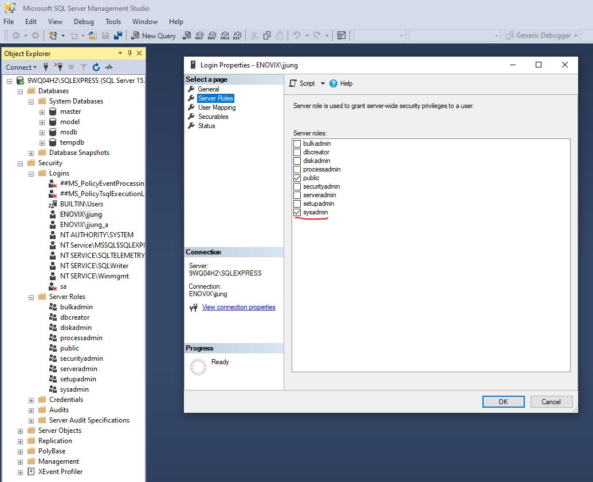

### 1. Steps to install SPEC development environment
0. Install a git software. Pick one of followings.
    - Git (http://gitforwindows.org)
    - TortoiseGit (https://tortoisegit.org/download/)
1. In Git Bash, git clone git@bitbucket.org:py_django/flexible_uploader.git
2. Open cmd as an admin and cd to created directory
3. Create the virtual environment.
    - C:\..\flexible_uploader>python -m venv .venv
4. Activate the virtual environment.
    - C:\..\flexible_uploader>.venv\Scripts\activate.bat
5. Load the package indicated in requirements.txt.
    - (.venv) C:\Users\aschwarz\source\repos\flexible_uploader>pip install wheel
    - (.venv) C:\Users\aschwarz\source\repos\flexible_uploader>pip install whl\python_ldap-3.4.0-cp310-cp310-win_amd64.whl   
    - (.venv) C:\Users\aschwarz\source\repos\flexible_uploader>pip install -r requirements.txt
    - If you run into an error while installing pyodbc because you need to install 
   Microsoft Visual C++ 14.0 or greater. The error message shows the url, 
   https://visualstudio.microsoft.com/visual-cpp-build-tools/. 
   You can download the vs_buildtools and install it. 
   Note, there are many options to install, and it is confusing what to install. 
   Visit the following url to select the packages you need.
   https://docs.microsoft.com/en-us/answers/questions/136595/error-microsoft-visual-c-140-or-greater-is-require.html
6. Exit the environment.
    - (.venv) C:\Users\aschwarz\source\repos\flexible_uploader>deactivate
7. Install following software
    - Postman (https://www.postman.com/downloads/)
    - Node.js (https://nodejs.org/en/download/)
8. npm install
    - npm install -g newman  (Postman command line runner)
    - npm install -g newman-reporter-htmlextra  (report output formatter)
    - Add %USERPROFILE%\AppData\Roaming\npm in user environment variable to run newman from anywhere.
9. Create the file flexible_uploader\proj\settings_local.py
     - Copy the contents of settings_local.py.template into this file 
10. Set Environment variables in flexible_uploader\proj\settings_local.py
     - LDAP_USER_ID used for LDAP binding
     - LDAP_PASSWD password for LDAP binding
     - APP_PROD_SKEY seed for csrftoken 
     - ADMIN_PASSWD for service account access during testing
     - UPLOADER_DB_HOST and UPLOADER_DB_NAME to point at desired database

### 2. Prepare backend server software in development environment
1. Install following software programs to host the MS SQL server.
	- SQL Server Management Studio (https://docs.microsoft.com/en-us/sql/ssms/download-sql-server-management-studio-ssms?view=sql-server-ver15)
	- SQL Server Express (https://www.microsoft.com/en-us/sql-server/sql-server-downloads)
2. Grant sysadmin permissions to yourself on your local SQL Server Express
	- Run SQL Server Management Studio as Administrator
	- Connect to .\sqlexpress
	- Open Security -> Logins
	- Add or edit your non-admin <user id>
	- Select server Roles
	- Check the sysadmin role
	- Click Ok.
	- Exit SQL Server Management	
	
	
3. Create a local spec_qa database to run the checked in settings file.

	

### 3. Start SPEC application via an IDE
0. Install a python IDE software. Pick one of followings.
	- Pycharm (https://www.jetbrains.com/pycharm/download)
	- Visual Studio Code (https://code.visualstudio.com/download)
1. Install Node.js and npm. Both are available from the following link.
	- https://nodejs.org/en
2. Launch the IDE and open the flexible_uploader folder. Select the python 
   interpreter in the .venv folder.
3. Navigate to the flexible_uploader/ui/frontend folder in the terminal and use npm to install needed packages.
	- C:\..\flexible_uploader\ui\frontend>npm install
4. Run npm run build to create a folder, flexible_uploader/frontend, which is STATICFILES_DIRS in setting.py.
	- C:\..\flexible_uploader\ui\frontend>npm run build
5. From the flexible_uploader folder, build schema.
	- C:\..\flexible_uploader>python manage.py migrate
6. From the flexible_uploader folder, run server
	- C:\..\flexible_uploader>python manage.py runserver
7. From the uploader_frontend folder, start express web server.
	- C:\..\flexible_uploader\ui\frontend>npm run serve
8. Open a web browser and navigate to the provided link (e.g. localhost:8080) to visit the web page.

	

### 4. Command line running of Postman test suite
1. Run in newman (command line)
	- [In flexible_uploader folder]
	- To see results in stdout: 
		newman run ".\tests\postman\flexible_uploader_test.postman_collection.json" -e "tests\postman\local_uploader_test.postman_environment.json"
	- To see results in file: newman\[test file]-[timestamp].html:
		newman run ".\tests\postman\flexible_uploader_test.postman_collection.json" -e "tests\postman\local_uploader_test.postman_environment.json" --reporters htmlextra
2. Run in Postman (Windows applicaiton)
	- Launch Postman
	- Use File -> Import to load tests\postman\*.json
	- Select the environment: local_uploader_test
	- Select loaded collection to run, click on three dot menu and select Run collection 
	- Click Run in Runner tab

### 5. Command line running of unit test suite
1. Run
	- Run with: py manage.py test

### 6. Command line running of unit test suite with code coverage
1. Install following software
	- pip install coverage 
2. Run 
	- coverage run --source='.' --omit='*asgi.py,*wsgi.py,*/test*.py,*/migrations/*,examples/*' manage.py test
3. Generate Report
	- Text report: coverage report
	- Html report: coverage html
		- Open result: htmlcov/index.html

### 7. Deploying changes
1. The deploy.ps1 script can be used to perform the update and deployment steps.
	- It must be run in an Administrator Powershell
	- It will do the pip install to verify everything is upto date
	- It will perform the migrate to update the database
	- It will run the npm build and collectstatic options to publish fronent changes
